# Laporan Praktikum 10

## Praktikum 1

Hasil Running Program:

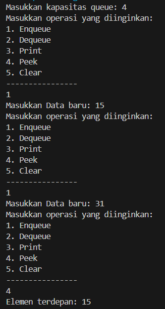

Pertanyaan:
1. Pada konstruktor, mengapa nilai awal atribut front dan rear bernilai -1, sementara atribut size 
bernilai 0?
2. Pada method Enqueue, jelaskan maksud dan kegunaan dari potongan kode berikut!

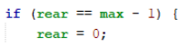

3. Pada method Dequeue, jelaskan maksud dan kegunaan dari potongan kode berikut!

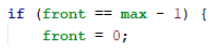

4. Pada method print, mengapa pada proses perulangan variabel i tidak dimulai dari 0 (int i=0), 
melainkan int i=front?
5. Perhatikan kembali method print, jelaskan maksud dari potongan kode berikut!

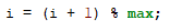

6. Tunjukkan potongan kode program yang merupakan queue overflow!
7. Pada saat terjadi queue overflow dan queue underflow, program tersebut tetap dapat berjalan 
dan hanya menampilkan teks informasi. Lakukan modifikasi program sehingga pada saat terjadi 
queue overflow dan queue underflow, program dihentikan!

Jawaban: 
1. Front dan rear bernilai -1 supaya tidak mengarah pada index array apapun, dan size bernilai 0 karena saat inisialisasi arraynya masih kosong.
2. Kegunaan kode tersebut adalah untuk melakukan pengecekan apakah posisi terakhir dalam antrian sudah mencapai batas maksimum.
3. Kegunaan kode tersebut adalah untuk mengatur ulang front ketika elemen pertama diambil, dan jika front sama dengan max-1 berarti sudah sampe di akhir array maka front diatur ulang ke 0.
4. Karena posisi front tidak selalu berada pada index 0, index dari front selalu berubah-ubah jika dilakukan pengambilan data.
5. Kode tersebut digunakan untuk kembali ke awal queue ketika mencapai akhir. operasi ini akan mengembalikan i kembali ke awal antrian dengan cara menghitung sisa pembagian (modulo) i + 1 dengan max.
6. 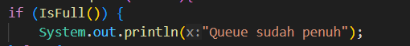
7. 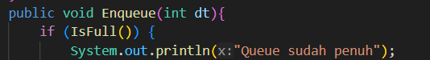
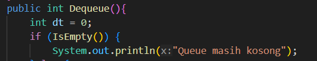

## Praktikum 2

Hasil Running Program:

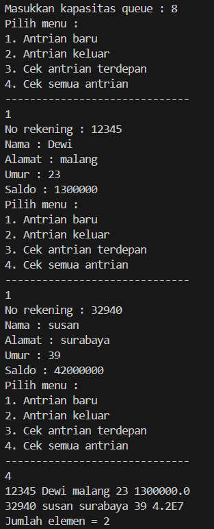

Pertanyaan:
1. Pada class QueueMain, jelaskan fungsi IF pada potongan kode program berikut!

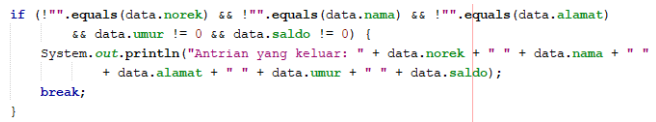

2. Lakukan modifikasi program dengan menambahkan method baru bernama peekRear pada class 
Queue yang digunakan untuk mengecek antrian yang berada di posisi belakang! Tambahkan pula 
daftar menu 5. Cek Antrian paling belakang pada class QueueMain sehingga method peekRear
dapat dipanggil!

Jawaban:
1. Kegunaan if pada kode program berikut adalah untuk memastikan bahwa data nasabah yang dikeluarkan dari antrian adalah data yang lengkap dan valid sebelum dicetak ke layar.
2. 
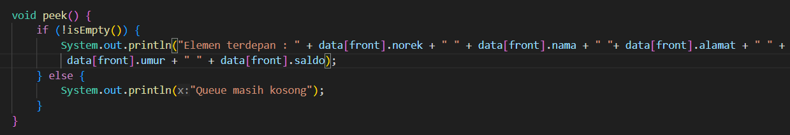

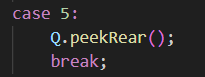

## Tugas

- Output

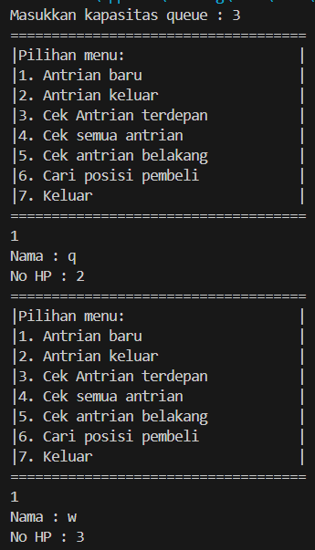

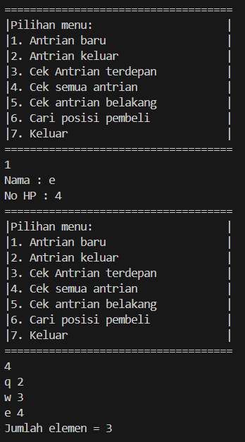

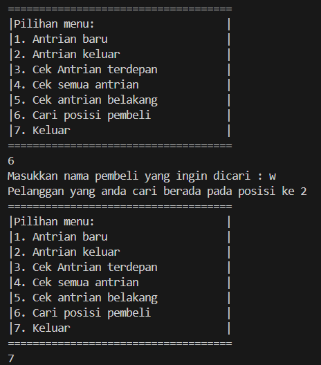
