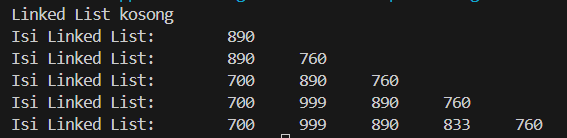
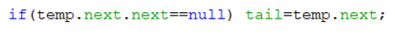

# Laporan Praktikum 11

## Pembuatan Single Linked List

Hasil Running Program:

Pertanyaan:
1. Mengapa hasil compile kode program di baris pertama menghasilkan “Linked List Kosong”?
2. Jelaskan kegunaan variable temp secara umum pada setiap method!
3. Perhatikan class SingleLinkedList, pada method insertAt Jelaskan kegunaan kode berikut

Jawaban:

## Modifikasi Elemen pada Single Linked List

