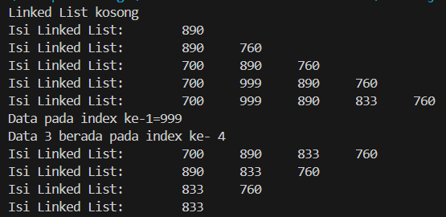
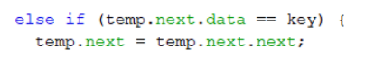
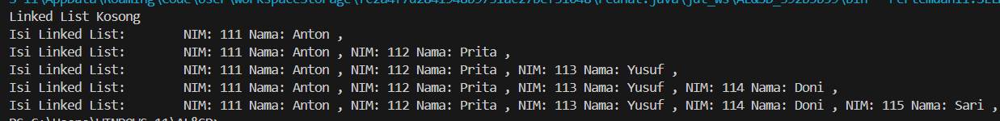
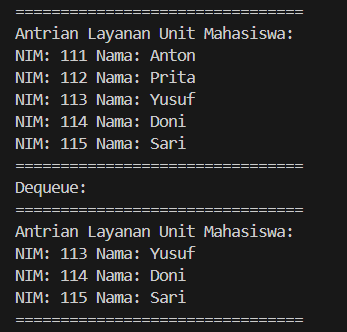

# Laporan Praktikum 11

## Pembuatan Single Linked List

Hasil Running Program:

Pertanyaan:
1. Mengapa hasil compile kode program di baris pertama menghasilkan “Linked List Kosong”?
2. Jelaskan kegunaan variable temp secara umum pada setiap method!
3. Perhatikan class SingleLinkedList, pada method insertAt Jelaskan kegunaan kode berikut

Jawaban:
1. karena pada baris pertama tidak memasukkan nilai apa", jadi output baris pertama adalah linked list kosong.
2. variabel temp digunakan untuk menyimpan nilai sementara dalam method. Ini membantu dalam memproses data, mengoptimalkan kode, menghindari duplikasi, serta membuat kode lebih mudah dimengerti. 
3. Kode tersebut mengubah nilai tail (node terakhir dalam linked list) menjadi temp.next jika temp.next.next adalah null (jadi tidak ada node setelah temp.next).

## Modifikasi Elemen pada Single Linked List

Hasil Running Program:

Pertanyaan:
1. Mengapa digunakan keyword break pada fungsi remove? Jelaskan!
2. Jelaskan kegunaan kode dibawah pada method remove

Jawaban:
1. Keyword break digunakan dalam fungsi remove untuk menghentikan iterasi setelah elemen yang ingin dihapus ditemukan.Ini membantu mencegah iterasi yang tidak perlu setelah tujuan pencarian tercapai, dan juga dapat meningkatkan efisiensi.
2. Kode tersebut digunakan untuk menghapus node yang memiliki data yang sesuai dengan keyS dengan mengubah pointer next dari node sebelumnya untuk mengarah ke node setelah node yang dihapus.

## Tugas

1. Hasil Running Tugas No 1 (Mahasiswa16, Node16, SingleLinkedList16, SLLMainTugas)

2. Hasil Running Tugas No 2 (Tugas2, NodeTugas2, SLLQueue, SLLMainQueue)

