# Laporan Pertemuan 12

## Percobaan 1

Hasil Running Program:

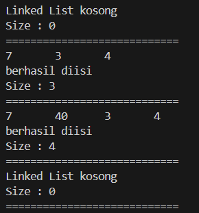

Pertanyaan:
1. Jelaskan perbedaan antara single linked list dengan double linked lists!
2. Perhatikan class Node, di dalamnya terdapat atribut next dan prev. Untuk apakah atribut 
tersebut?
3. Perhatikan konstruktor pada class DoubleLinkedLists. Apa kegunaan inisialisasi atribut head dan size seperti pada gambar berikut ini?

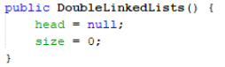

4. Pada method addFirst(), kenapa dalam pembuatan object dari konstruktor class Node prev 
dianggap sama dengan null?
Node newNode = new Node(null, item, head);
5. Perhatikan pada method addFirst(). Apakah arti statement head.prev = newNode ?
6. Perhatikan isi method addLast(), apa arti dari pembuatan object Node dengan mengisikan 
parameter prev dengan current, dan next dengan null?
Node newNode = new Node(current, item, null);
7. Pada method add(), terdapat potongan kode program sebagai berikut:
jelaskan maksud dari bagian yang ditandai dengan kotak kuning.

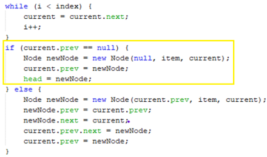

Jawaban:
1. Single linked list hanya bisa maju(next), kalau double linked list bisa 2 arah maju dan sebaliknya(next dan prev).
2. Atribut tersebut untuk mengakses data selanjut dan sebelumnya, sehingga next dan prev digunakan untuk pointer data setelah dan data sebelumnya.
3. Kegunaan head = null karena belum ada satupun node yang dibuat. Sedangkan size = 0 dilakukan karena pada saat awal dibuat, belum terdapat node apapun sehingga sizenya bernilai 0.
4. Karena node yang dimasukkan pada method addFirst() akan menjadi Node head dan prev dari head bernilai null.
5. Dalam head.prev = newNode, artinya adalah data data yang ditambahkan akan menjadi prev dari data head sebelumnya.
6. Karena pada data terakhir pointer selanjutnya adalah null.
7. Maksud dari bagian tersebut adalah jika current adalah head maka akan dibuat newNode dengan next berada pada current dan prev bernilai null, Lalu prev dari current akan dimasukkan newNode dan newNode akan menjadi head.

## Percobaan 2

Hasil Running Program:

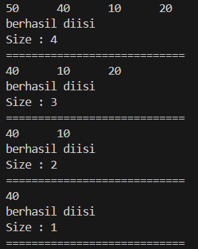

Pertanyaan:
1. Apakah maksud statement berikut pada method removeFirst()?
head = head.next;
head.prev = null;
2. Bagaimana cara mendeteksi posisi data ada pada bagian akhir pada method removeLast()?
3. Jelaskan alasan potongan kode program di bawah ini tidak cocok untuk perintah remove!

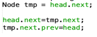

4. Jelaskan fungsi kode program berikut ini pada fungsi remove!

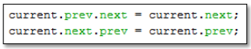

Jawaban:
1. Maksudnya adalah Node selanjutnya dari head akan menjadi head yang baru lalu prev dari head yang baru akan menjadi null.
2. Menggunakan current, awalnya current diatur pada head, lalu berjalan ketika current.next.next tidak null maka current akan terus bertambah hingga current.next.next = null.
3. Karena nilai dari tmp nya head.next, tidak ada set null.
4. Pointer next dari node sebelum current akan menunjuk pada node setelah current dan pointer prev dari node setelah current akan menunjuk pada node sebelum current.

## Percobaan 3

Hasil Running Program:

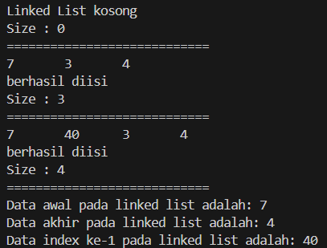

Pertanyaan:
1. Jelaskan method size() pada class DoubleLinkedLists!
2. Jelaskan cara mengatur indeks pada double linked lists supaya dapat dimulai dari indeks ke-1!
3. Jelaskan perbedaan karakteristik fungsi Add pada Double Linked Lists dan Single Linked Lists! 
4. Jelaskan perbedaan logika dari kedua kode program di bawah ini!

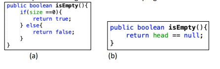

Jawaban:
1. Untuk mengembalikan nilai dari variabel size.
2. Caranya adalah dengan mengatur iterasi dan mengubah pointer pada method add() dan get() untuk memulai dari indeks ke-1 dan melakukan pengecekan jika i sama dengan index.
3. Double linked list memiliki dua referensi yaitu prev dan next, sedangkan Single linked list hanya memiliki satu referensi yaitu next.
4. Gambar (a) digunakan untuk mengecek kosong tidaknya data berdasarkan size, jika size == 0 maka true, jika tidak maka false, sedangkan gambar (b) digunakan untuk mengecek kosong tidaknya data berdasarkan head, jika head == null maka true, jika tidak maka false.

## Tugas

1. - Output:

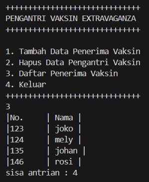

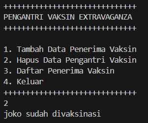

2. - Output

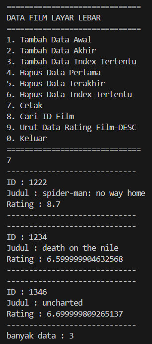

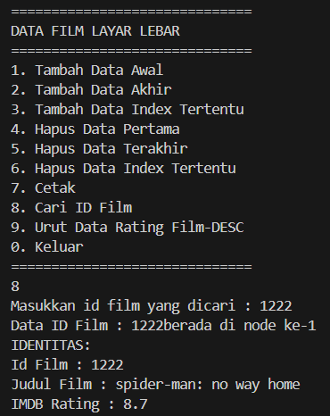