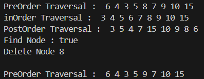
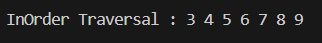
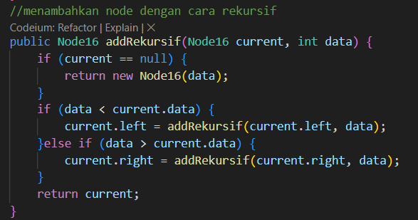
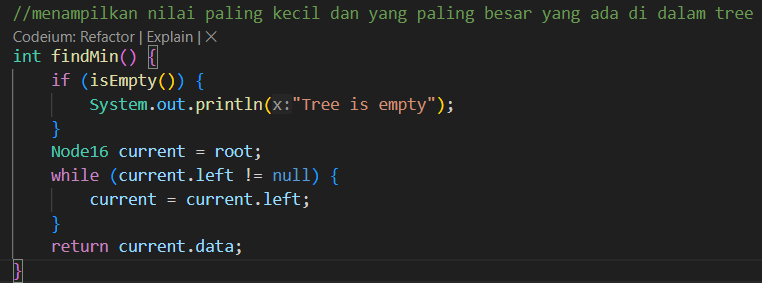
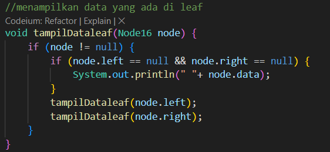
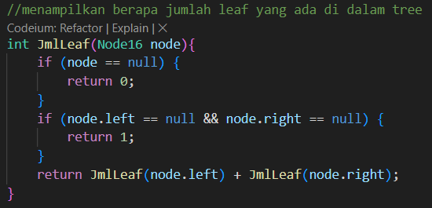
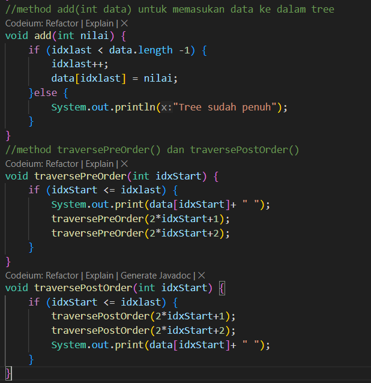

# Laporan Pertemuan 13

## Percobaan 1: Implementasi Binary Search Tree menggunakan Linked List

Hasil Running Program:

Pertanyaan:
1. Mengapa dalam binary search tree proses pencarian data bisa lebih efektif dilakukan dibanding 
binary tree biasa?
2. Untuk apakah di class Node, kegunaan dari atribut left dan right?
3. a. Untuk apakah kegunaan dari atribut root di dalam class BinaryTree?
b. Ketika objek tree pertama kali dibuat, apakah nilai dari root?
4. Ketika tree masih kosong, dan akan ditambahkan sebuah node baru, proses apa yang akan terjadi?
5. Perhatikan method add(), di dalamnya terdapat baris program seperti di bawah ini. Jelaskan 
secara detil untuk apa baris program tersebut?
if(data < current.data){
 if(current.left!=null){
 current = current.left;
 }else{
 current.left = new Node(data);
 break;
 }
}

Jawaban:
1. Karena binary search tree lebih efektif untuk pencarian data karena struktur terurut dan lebih efisien dibanding binary tree biasa.
2. Dalam class Node, atribut left dan right digunakan untuk menunjuk ke anak kiri dan anak kanan dari node tersebut.
3. a.  Atribut root adalah sebagai node utama/ induk dari sebuah tree
b. Nilainya adalah null
4. Proses yang terjadi adalah data yang ada akan menjadi root lalu left-child dan right-child akan diberi nilai null untuk pertama kali.
5. Pada program ini bertujuan untuk menambahkan node baru ke dalam binary search tree. Jika nilai data lebih kecil dari nilai node saat ini (current), program akan memeriksa apakah anak kiri dari node saat ini ada. Jika ada, pencarian dilanjutkan ke anak kiri. Jika tidak ada, node baru akan ditambahkan sebagai anak kiri dari node saat ini, dan proses penambahan selesai dengan keluar dari loop.

## Percobaan 2: Implementasi binary tree dengan array

Hasil Running Program:

Pertanyaan:
1. Apakah kegunaan dari atribut data dan idxLast yang ada di class BinaryTreeArray?
2. Apakah kegunaan dari method populateData()?
3. Apakah kegunaan dari method traverseInOrder()?
4. Jika suatu node binary tree disimpan dalam array indeks 2, maka di indeks berapakah posisi 
left child dan rigth child masin-masing?
5. Apa kegunaan statement int idxLast = 6 pada praktikum 2 percobaan nomor 4?

Jawaban:
1. Atribut data adalah variabel yang digunakan untuk menyimpan data atua nilai, dan idxLast adalah indeks terkahir dari node yang ada pada data.
2. Untuk menginisialisasi atribut data dan idxLast
3. method tersebut digunakan untuk melakukan penelusuran pada binary tree yang nantinya akan diprint dalam bentuk urutan nilai dengan urutan left-root-right
4. left-child : indeks 5 dan right-child : 6
5. Kegunaan dari statement int idxLast = 6 untuk menetapkan indeks terakhir dari elemen yang valid dalam array data. Ini digunakan dalam konteks pohon biner yang diimplementasikan menggunakan array.

## Tugas Praktikum 

1. Buat method di dalam class BinaryTree yang akan menambahkan node dengan cara rekursif.

2. Buat method di dalam class BinaryTree untuk menampilkan nilai paling kecil dan yang paling besar yang ada di dalam tree.

 

3. Buat method di dalam class BinaryTree untuk menampilkan data yang ada di leaf.

4. Buat method di dalam class BinaryTree untuk menampilkan berapa jumlah leaf yang ada di dalam tree.

5. Modifikasi class BinaryTreeArray, dan tambahkan :
• method add(int data) untuk memasukan data ke dalam tree
• method traversePreOrder() dan traversePostOrder()

