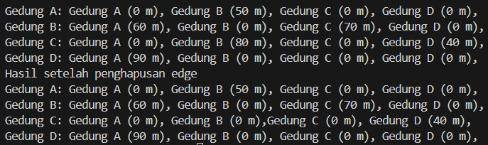

# Laporan Praktikum 15

## Percobaan 1

Hasil Running Program:


Pertanyaan:
1. Perbaiki kode program Anda apabila terdapat error atau hasil kompilasi kode tidak sesuai!
2. Pada class Graph, terdapat atribut list[] bertipe DoubleLinkedList. Sebutkan tujuan pembuatan 
variabel tersebut!
3. Jelaskan alur kerja dari method removeEdge!
4. Apakah alasan pemanggilan method addFirst() untuk menambahkan data, bukan method add 
jenis lain saat digunakan pada method addEdge pada class Graph?
5. Modifikasi kode program sehingga dapat dilakukan pengecekan apakah terdapat jalur antara 
suatu node dengan node lainnya, seperti contoh berikut (Anda dapat memanfaatkan Scanner).


Jawaban:
1. kode program yang error sudah saya perbaiki dan sudah saya lampirkan pada 
hasil percobaan di atas.
2. Tujuan pembuatan variabel ini adalah untuk menyimpan informasi tentang koneksi antara vertex dalam grafik.
3. Method removeEdge digunakan untuk menghapus edge antara dua vertex dalam grafik. Menerima parameter asal dan tujuan, method ini melakukan perulangan dan menghapus edge dari list[asal] jika kondisi terpenuhi.
4. Untuk memastikan supaya edge yang baru berada pada head/awal node.
5. 
- Pada class Graph


- Pada class GraphMain


## Percobaan 2

Hasil Running Program;



Pertanyaan:
1. Perbaiki kode program Anda apabila terdapat error atau hasil kompilasi kode tidak sesuai!
2. Apa jenis graph yang digunakan pada Percobaan 2?
3. Apa maksud dari dua baris kode berikut?


4. Modifikasi kode program sehingga terdapat method untuk menghitung degree, termasuk 
inDegree dan outDegree!

Jawaban:
1. kode program awalnya menghasilkan output tidak sesuai dengan jobsheet, 
lalu saya merubah System.out.println("Gedung " + (char) ('A' + j) + " (" + matriks[i][j] + " m), "); mennjadi System.out.print("Gedung " + (char) ('A' + j) + " (" + matriks[i][j] + " m), ");
2. Graph matriks.
3. Membuat edge dari gedung B ke gedung C dengan jarak 70m dan gedung C ke gedung B dengan jarak 80m.
4. 
- method degree


- output


## Tugas Latihan Praktikum

1. Modifikasi kode program pada class GraphMain sehingga terdapat menu program yang bersifat dinamis, setidaknya terdiri dari:
- a) Add Edge
- b) Remove Edge
- c) Degree
- d) Print Graph
- e) Cek Edge Pengguna dapat memilih menu program melalui input Scanner
2. Tambahkan method updateJarak pada Percobaan 1 yang digunakan untuk mengubah jarak antara dua node asal dan tujuan!
3. Tambahkan method hitungEdge untuk menghitung banyaknya edge yang terdapat di dalam graf!

Jawaban:
1.
```
package Pertemuan15;

import java.util.Scanner;

public class GraphMain16 {
        public static void main(String[] args) throws Exception {
            Scanner scanner = new Scanner(System.in);
            System.out.print("Masukkan jumlah gedung: ");
            int jumlahGedung = scanner.nextInt();
    
            Graph16 gedung = new Graph16(jumlahGedung);
    
            boolean exit = false;
            while (!exit) {
                System.out.println("=====================");
                System.out.println("|   Menu Program:   |");
                System.out.println("=====================");
                System.out.println("|1. Add Edge        |");
                System.out.println("|2. Remove Edge     |");
                System.out.println("|3. Degree          |");
                System.out.println("|4. Print Graph     |");
                System.out.println("|5. Check Edge      |");
                System.out.println("|6. Exit            |");
                System.out.println("=====================");
                System.out.print("Pilih menu: ");
                int pilihan = scanner.nextInt();
    
                switch (pilihan) {
                    case 1:
                        System.out.print("Masukkan gedung asal: ");
                        int asalAdd = scanner.nextInt();
                        System.out.print("Masukkan gedung tujuan: ");
                        int tujuanAdd = scanner.nextInt();
                        System.out.print("Masukkan bobot: ");
                        int bobotAdd = scanner.nextInt();
                        gedung.addEdge(asalAdd, tujuanAdd, bobotAdd);
                        break;
                    case 2:
                        System.out.print("Masukkan gedung asal: ");
                        int asalRemove = scanner.nextInt();
                        System.out.print("Masukkan gedung tujuan: ");
                        int tujuanRemove = scanner.nextInt();
                        gedung.removeEdge(asalRemove, tujuanRemove);
                        break;
                    case 3:
                        System.out.print("Masukkan gedung: ");
                        int gedungDegree = scanner.nextInt();
                        gedung.degree(gedungDegree);
                        break;
                    case 4:
                        gedung.printGraph();
                        break;
                    case 5:
                        System.out.print("Masukkan gedung asal: ");
                        int asalCheck = scanner.nextInt();
                        System.out.print("Masukkan gedung tujuan: ");
                        int tujuanCheck = scanner.nextInt();
                        boolean tetangga = gedung.isAdjacent(asalCheck, tujuanCheck);
                        char gedungAsal = (char) ('A' + asalCheck);
                        char gedungTujuan = (char) ('A' + tujuanCheck);
                        if (tetangga) {
                            System.out.println("Gedung " + gedungAsal + " dan " + gedungTujuan + " bertetangga");
                        } else {
                            System.out.println("Gedung " + gedungAsal + " dan " + gedungTujuan + " tidak bertetangga");
                        }
                        break;
                    case 6:
                        exit = true;
                        break;
                    default:
                        System.out.println("Pilihan tidak valid.");
                }
            }
    
            scanner.close();
        }
    }
```
2. 
- method updateJarak() di class Graph
``` 
public void updateJarak(int asal, int tujuan, int jarakBaru) throws Exception {
        boolean cek = false;
        for(int i = 0; i < list[asal].size(); i++) {
            if(list[asal].get(i) == tujuan) {
                cek = true;
            }
        }
        if (cek == true) {
            list[asal].updateJarak(tujuan, jarakBaru);
            System.out.println("Jarak Gedung " + (char) ('A' + asal) + " dan " + (char) ('A' + tujuan) + " diperbarui menjadi " + jarakBaru + " m");
        } else {
            System.out.println("Gedung " + (char) ('A' + asal) + " dan " + (char) ('A' + tujuan) + " tidak bertetangga");
        }
    }
```

- method updateJarak() di class DoubleLinkedList
```
public void updateJarak(int tujuan, int jarakBaru) throws Exception {
        Node16 current = head;
        boolean cek = false;
        while (current != null) {
            if (current.data == tujuan) {
                current.jarak = jarakBaru;
                cek = true;
                break;
            }
            current = current.next;
        }
        if (!cek) {
            throw new Exception("Tujuan tidak ditemukan dalam daftar");
        }
    }
```

3. 
- method hitungEdge()
```
public void hitungEdge() {
        int jml = 0;
        for (int i = 0; i < vertex; i++) {
            jml += list[i].size();
        }
        System.out.println("Jumlah Edge dari Graph: " + jml);
    }
```