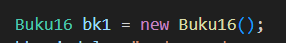

# Laporan Praktikum 2

##  Percobaan 1: Deklarasi Class, Atribut dan Method

Kode program

Hasil Running program

Pertanyaan
1. Sebutkan dua karakteristik class atau object!
2. Perhatikan class Buku pada Praktikum 1 tersebut, ada berapa atribut yang dimiliki oleh class 
Buku? Sebutkan apa saja atributnya!
3. Ada berapa method yang dimiliki oleh class tersebut? Sebutkan apa saja methodnya!
4. Perhatikan method terjual() yang terdapat di dalam class Buku. Modifikasi isi method tersebut 
sehingga proses pengurangan hanya dapat dilakukan jika stok masih ada (lebih besar dari 0)!
5. Menurut Anda, mengapa method restock() mempunyai satu parameter berupa bilangan int?
6. Commit dan push kode program ke Github

Jawaban
1. Inheritance dan Encapsulation.
2. Ada 5 atribut : 
   1. judul
   2. pengarang
   3. halaman
   4. stock
   5. harga
3. Ada 4 method : 
   1. tampilInformasi()
   2. terjual()
   3. restock()
   4. gantiHarga()
4. 
5. Karena parameter int tersebut dapat menampilkan jumlah barang yang akan diperbarui atau ditambahkan pada saat melakukan restock barang.

## Percobaan 2: Instansiasi Object, serta Mengakses Atribut dan Method

Kode program

Hasil Running program

Pertanyaan
1. Pada class BukuMain, tunjukkan baris kode program yang digunakan untuk proses instansiasi!
Apa nama object yang dihasilkan?
2. Bagaimana cara mengakses atribut dan method dari suatu objek?
3. Mengapa hasil output pemanggilan method tampilInformasi() pertama dan kedua berbeda?

Jawaban
1. 
2. Caranya yaitu dengan menggunakan sintaks titik (.) setelah nama objek dan diikuti dengan nama atribut atau methode yang ingin anda akses.
3. Karena stock buku telah diubah dengan memanggil metode 'tambahStock()' diantara dua pemanggilan 'tampilInformasi()'.

## Percobaan 3: Membuat Konstruktor

Kode program

Hasil Running program

Pertanyaan
1. Pada class Buku di Percobaan 3, tunjukkan baris kode program yang digunakan untuk 
mendeklarasikan konstruktor berparameter!
2. Perhatikan class BukuMain. Apa sebenarnya yang dilakukan pada baris program berikut?

3. Hapus konstruktor default pada class Buku, kemudian compile dan run program. Bagaimana 
hasilnya? Jelaskan mengapa hasilnya demikian!
4. Setelah melakukan instansiasi object, apakah method di dalam class Buku harus diakses 
secara berurutan? Jelaskan alasannya!
5. Buat object baru dengan nama buku<NamaMahasiswa> menggunakan konstruktor 
berparameter dari class Buku!
6. Commit dan push kode program ke Github

Jawaban
1. 
2. Baris program tersebut adalah sebuah object bernama bk2 yang menggunakan konstruktor berparameter, yang fungsinya untuk menginisialisasi atribut object pada saat object dibuat.
3. 
hasilnya error karena ketika membuat object menggunakan sintaks 'new Buku16()', java mencari konstruktor default di kelas 'Buku16' yang tidak memiliki parameter. jika konstruktor default tidak ditemukan, maka kesalahan akan muncul.
4. Tidak, karena ada beberapa alasan yaitu:
    1. Method dalam sebuah class bersifat independen satu sama lain. 
    2. Method hanya menjalankan fungsionalitas yang telah didefinisikan di dalamnya. Method tidak saling tergantung satu sama lain.
    3. Urutan eksekusi method tergantung pada desain program dan logika bisnis yang ingin diimplementasikan.
    4. Urutannya tidak harus sesuai deklarasi method di dalam class.
    5. urutan pemanggilan method bersifat fleksibel dan tergantung logically program yang ingin dibuat. 
5. 

## Latihan Praktikum

1. 