# LAPORAN PRAKTIKUM 3

## Percobaan 1: Membuat Array dari Object, Mengisi dan Menampilkan

Kode Program:
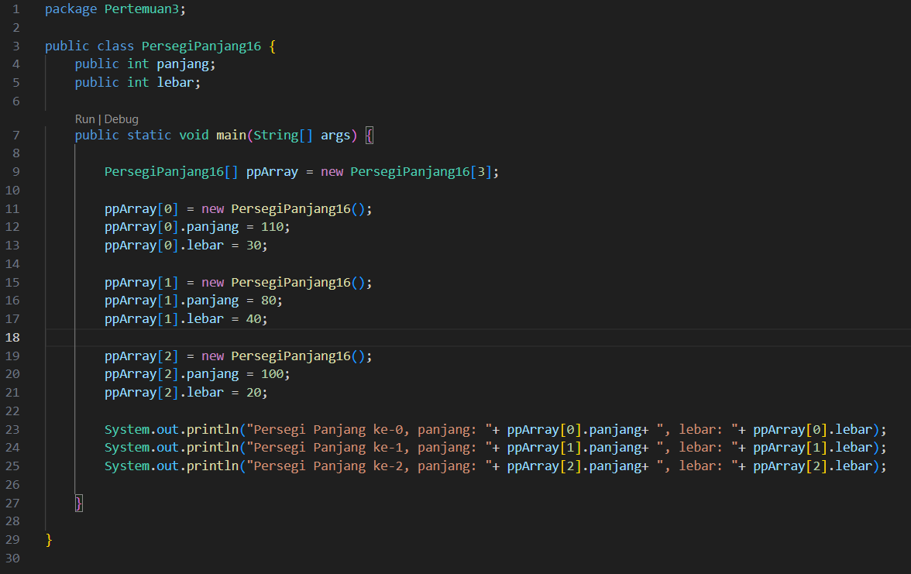

Hasil Running Program:
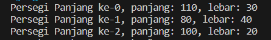

Pertanyaan:
1. Berdasarkan uji coba 3.2, apakah class yang akan dibuat array of object harus selalu memiliki 
atribut dan sekaligus method?Jelaskan!
2. Apakah class PersegiPanjang memiliki konstruktor?Jika tidak, kenapa dilakukan pemanggilan 
konstruktur pada baris program berikut :
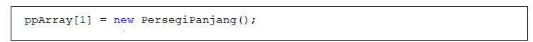
3. Apa yang dimaksud dengan kode berikut ini:
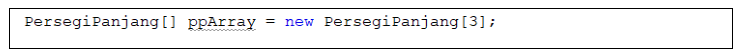
4. Apa yang dimaksud dengan kode berikut ini:
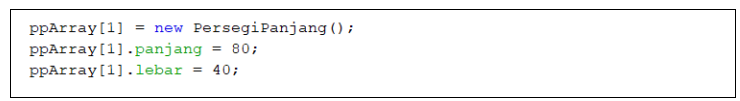
5. Mengapa class main dan juga class PersegiPanjang dipisahkan pada uji coba 3.2

Jawaban:
1. Harus memiliki atribut dan method, karena jika tidak ada atribut dan method maka objek nya tidak akan bisa terbentuk.
2. Class tersebut tidak memiliki konstruktor, pada baris program tersebut bukan merupakan pemanggilan konstruktor, tetapi baris kode tersebut menginstansiasi objek pada array objek ke-2 di PersegiPanjang
3. Kode tersebut menjelaskan bahwa kita membuat sebuah array yang dapat menampung 3 objek dari class 'PersegiPanjang16' dan menyimpannya dalam variable 'ppArray'.
4. Kode tersebut adalah array 'ppArray' yang bermaksud untuk menyimpan objek-objek dari 'PersegiPanjang16', kemudian mengakses objek pada indeks ke-1 dari array tersebut untuk mengatur nilai atribut 'panjang' dan 'lebar'.
5. Karena pada class main itu bertanggung jawab untuk mengatur alur eksekusi utama program, sedangkan class PersegiPanjang  bertanggung jawab untuk mendefinisikan objek persegi panjang.

## Percobaan 2: Menerima Input Isian Array Menggunakan Looping

Kode Program:
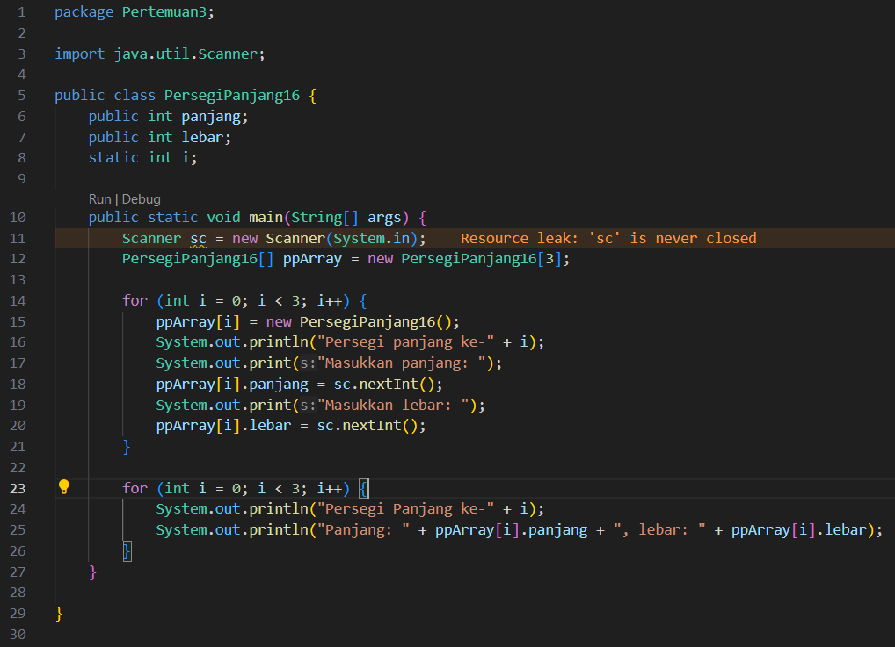

Hasil Running Program:

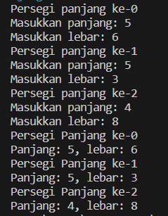

Pertanyaan:
1. Apakah array of object dapat diimplementasikan pada array 2 Dimensi?
2. Jika jawaban soal no satu iya, berikan contohnya! Jika tidak, jelaskan!
3. Jika diketahui terdapat class Persegi yang memiliki atribut sisi bertipe integer, maka kode 
dibawah ini akan memunculkan error saat dijalankan. Mengapa?
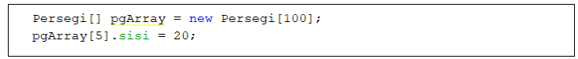
4. Modifikasi kode program pada praktikum 3.3 agar length array menjadi inputan dengan Scanner!
5. Apakah boleh Jika terjadi duplikasi instansiasi array of objek, misalkan saja instansiasi dilakukan 
pada ppArray[i] sekaligus ppArray[0]?Jelaskan!

Jawaban:
1. Ya, array of object dapat di implementasikan pada array 2 dimensi.
2. Karena pada array of object dapat di implementasikan dalam array 2 dimensi dengan cara mendefinisikan array 2 dimensi yang dimana setiap elemennya adalah objek dari suatu class.
3. Karena pada kode tersebut belum melakukan instansiasi objek array nya, sehingga menyebabkan arror.
4. Dengan cara membuat variable yang nilai nya diisi melalui inputan, lalu variable tersebut dipakai pada saat deklarasi array.
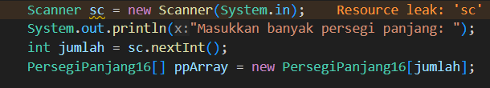
5. Boleh saja, tetapi yang akan dijalankan oleh program adalah instansiasi yang terakhir.

##  Percobaan 3: Penambahan Operasi Matematika di Dalam Method

Kode Program:
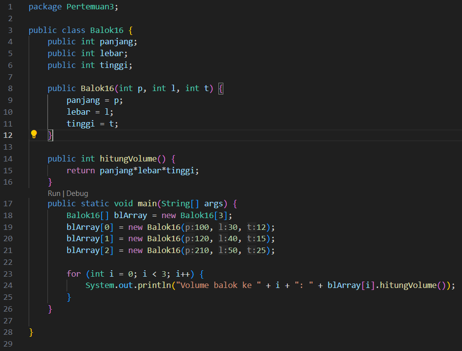

Hasil Running Program:

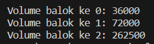

Pertanyaan:
1. Dapatkah konstruktor berjumlah lebih dalam satu kelas? Jelaskan dengan contoh!
2. Jika diketahui terdapat class Segitiga seperti berikut ini:
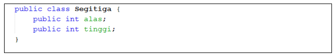
Tambahkan konstruktor pada class Segitiga tersebut yang berisi parameter int a, int t
yang masing-masing digunakan untuk mengisikan atribut alas dan tinggi.
3. Tambahkan method hitungLuas() dan hitungKeliling() pada class Segitiga
tersebut. Asumsi segitiga adalah segitiga siku-siku. (Hint: Anda dapat menggunakan bantuan 
library Math pada Java untuk mengkalkulasi sisi miring)
4. Pada fungsi main, buat array Segitiga sgArray yang berisi 4 elemen, isikan masing-masing 
atributnya sebagai berikut:
sgArray ke-0 alas: 10, tinggi: 4
sgArray ke-1 alas: 20, tinggi: 10
sgArray ke-2 alas: 15, tinggi: 6
sgArray ke-3 alas: 25, tinggi: 10
5. Kemudian menggunakan looping, cetak luas dan keliling dengan cara memanggil method 
hitungLuas() dan hitungKeliling().

Jawaban:
1. Ya, dapat dengan menambahkan konstruktor default seperti gambar dibawah ini:
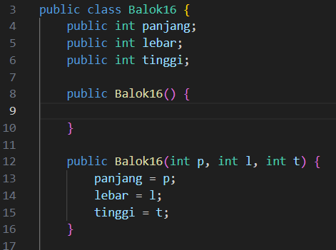
2. Seperti gambar dibawah ini:
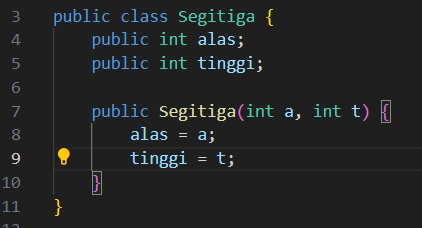
3. 
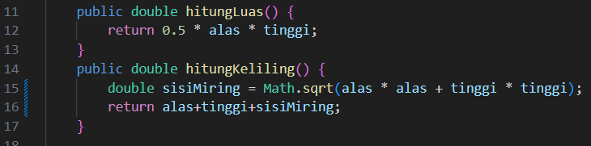
4. 
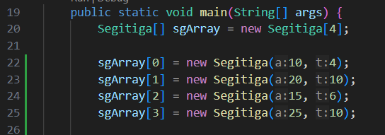
5. 
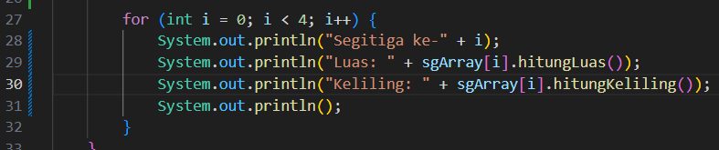

## Latihan Praktikum

# No 1.
Output:

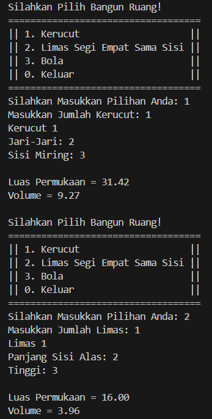
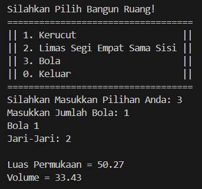

# No 2.
Output:

