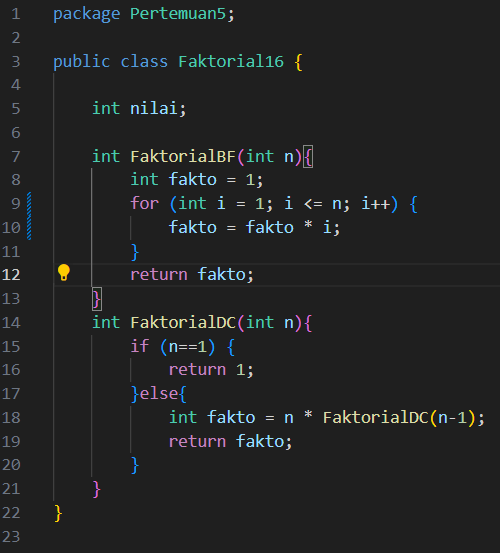
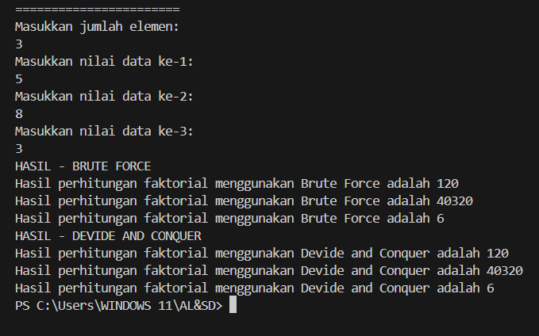
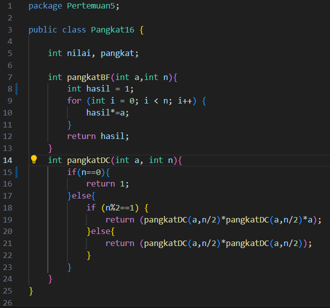
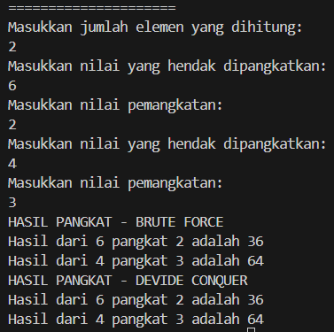

# LAPORAN PRAKTIKUM 5

## Percobaan 1: Menghitung Nilai Faktorial dengan Algoritma Brute Force dan Divide and Conquer

Kode Program:

Hasil Running Program:

Pertanyaan:
1. Pada base line Algoritma Divide Conquer untuk melakukan pencarian nilai faktorial, jelaskan 
perbedaan bagian kode pada penggunaan if dan else!
2. Apakah memungkinkan perulangan pada method faktorialBF() dirubah selain menggunakan 
for?Buktikan!
3. Jelaskan perbedaan antara fakto *= i; dan int fakto = n * faktorialDC(n-1); !

Jawaban:
1. 

## Percobaan 2: Menghitung Hasil Pangkat dengan Algoritma Brute Force dan Divide and Conquer

Kode Program:

Hasil Running Program:

Pertanyaan: 
1. Jelaskan mengenai perbedaan 2 method yang dibuat yaitu PangkatBF() dan PangkatDC()!
2. Apakah tahap combine sudah termasuk dalam kode tersebut?Tunjukkan!
3. Modifikasi kode program tersebut, anggap proses pengisian atribut dilakukan dengan 
konstruktor.
4. Tambahkan menu agar salah satu method yang terpilih saja yang akan dijalankan menggunakan 
switch-case!

Jawaban:

## Percobaan 3:  Menghitung Sum Array dengan Algoritma Brute Force dan Divide and Conquer

Kode Program;
<>

Hasil Running Program:
<>

Pertanyaan:
1. Mengapa terdapat formulasi return value berikut?Jelaskan!

2. Kenapa dibutuhkan variable mid pada method TotalDC()?
3. Program perhitungan keuntungan suatu perusahaan ini hanya untuk satu perusahaan saja. 
Bagaimana cara menghitung sekaligus keuntungan beberapa bulan untuk beberapa 
perusahaan.(Setiap perusahaan bisa saja memiliki jumlah bulan berbeda-beda)? Buktikan 
dengan program!
