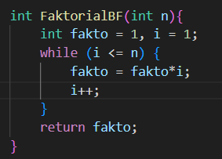
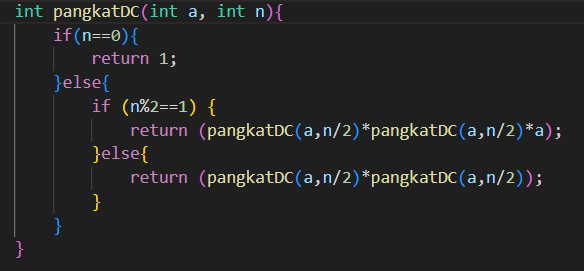
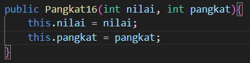
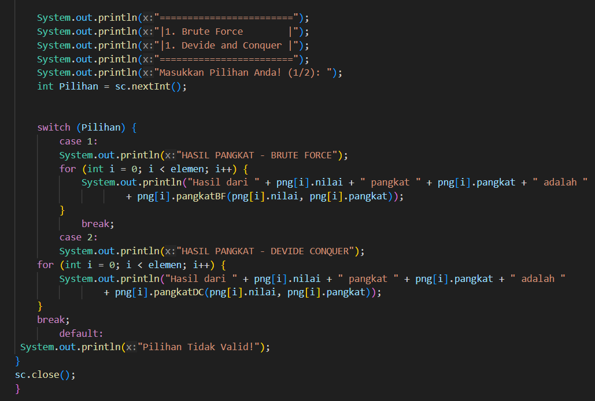
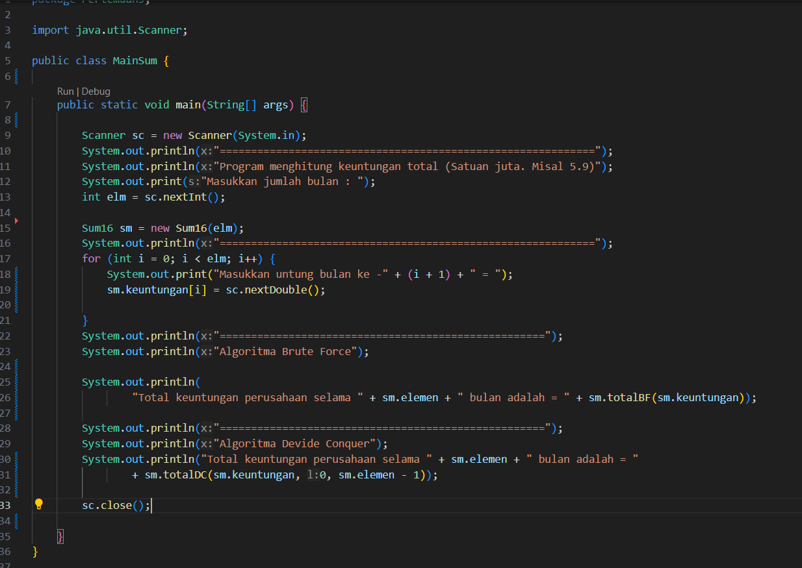
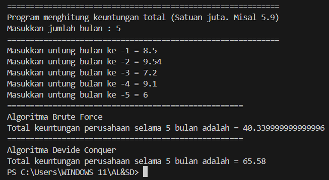
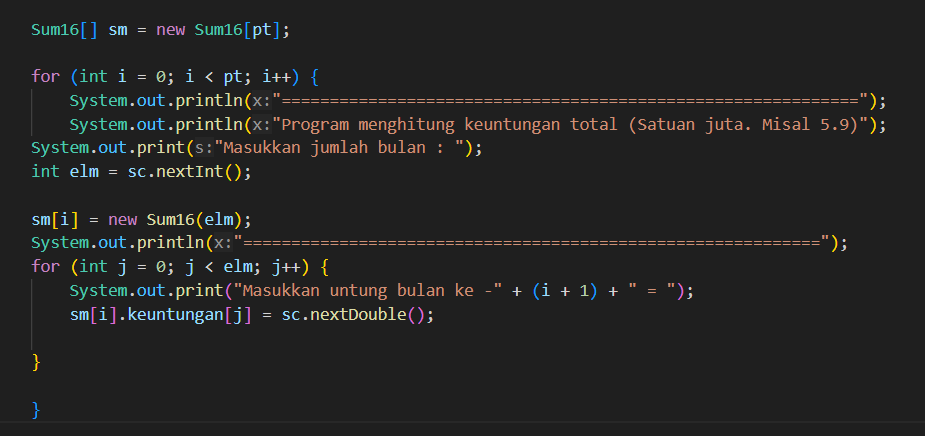
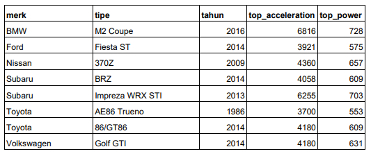
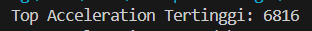
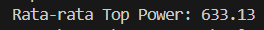

# LAPORAN PRAKTIKUM 5

## Percobaan 1: Menghitung Nilai Faktorial dengan Algoritma Brute Force dan Divide and Conquer

Kode Program:

Hasil Running Program:

Pertanyaan:
1. Pada base line Algoritma Divide Conquer untuk melakukan pencarian nilai faktorial, jelaskan 
perbedaan bagian kode pada penggunaan if dan else!
2. Apakah memungkinkan perulangan pada method faktorialBF() dirubah selain menggunakan 
for?Buktikan!
3. Jelaskan perbedaan antara fakto *= i; dan int fakto = n * faktorialDC(n-1); !

Jawaban:
1. penggunaan if dalam kode tersebut adalah sebagai batas dari perulangan rekursif, dan penggunaan else dalam kode tersebut adalah sebagai pengguna metode rekursif
2. masih bisa dengan menggunakan metode while

3. 
- fakto *= i; adalah perkalian sederhana yang nantinya fakto akan dikalikan dengan nilai i.
- fakto = n * faktorialDC(n-1); adalah perkalian yang menggunakan metode rekursif yang dilakukan hingga mencapai batas berhenti.

## Percobaan 2: Menghitung Hasil Pangkat dengan Algoritma Brute Force dan Divide and Conquer

Kode Program:

Hasil Running Program:

Pertanyaan: 
1. Jelaskan mengenai perbedaan 2 method yang dibuat yaitu PangkatBF() dan PangkatDC()!
2. Apakah tahap combine sudah termasuk dalam kode tersebut?Tunjukkan!
3. Modifikasi kode program tersebut, anggap proses pengisian atribut dilakukan dengan 
konstruktor.
4. Tambahkan menu agar salah satu method yang terpilih saja yang akan dijalankan menggunakan 
switch-case!

Jawaban:
1. 
- PangkatBF() adalah suatu metode yang mengalikan basis sebanyak eksponen kali secara langsung.
- PangkatDC() adalah suatu metode yang membagi masalah menjadi submasalah yang lebih kecil dan menggunakan rekursif untuk mengatasi perhitungan dengan lebih efisien.
2. Tidak, karena dalam penggunaan metode devide conquer yang dilakukan hanyalah pembagian angka pangkat.

3. 

4. 

## Percobaan 3:  Menghitung Sum Array dengan Algoritma Brute Force dan Divide and Conquer

Kode Program;

Hasil Running Program:

Pertanyaan:
1. Mengapa terdapat formulasi return value berikut?Jelaskan!

2. Kenapa dibutuhkan variable mid pada method TotalDC()?
3. Program perhitungan keuntungan suatu perusahaan ini hanya untuk satu perusahaan saja. 
Bagaimana cara menghitung sekaligus keuntungan beberapa bulan untuk beberapa 
perusahaan.(Setiap perusahaan bisa saja memiliki jumlah bulan berbeda-beda)? Buktikan 
dengan program!

Jawaban:
1. Karena return tersebut berfungsi untuk menjumlahkan masing-masing nilai yang telah dimasukkan menjadi total akhir dari keuntungan perusahaan.
2. Karena variable tersebut berguna sebagai nilai tengah dan membagi submasalah menjadi 2 bagian yang sama besar.
3. 

## Latihan Praktikum
1. Sebuah showroom memiliki daftar mobil dengan data sesuai tabel di bawah ini

Tentukan:

a) top_acceleration tertinggi menggunakan Divide and Conquer!

b) top_acceleration terendah menggunakan Divide and Conquer!

c) Rata-rata top_power dari seluruh mobil menggunakan Brute Force!

Jawaban:

a) 

b) 

c) 
