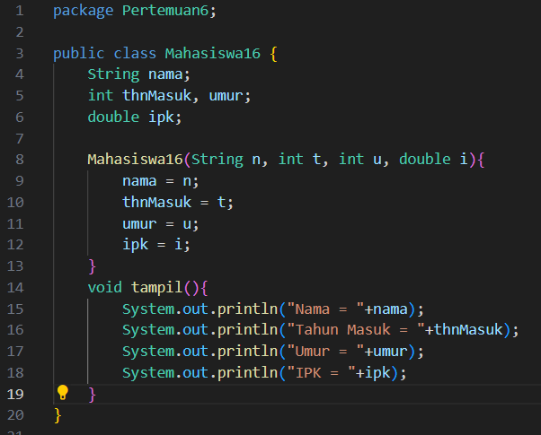
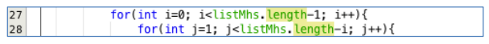
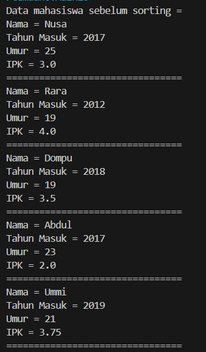

# Laporan Praktikum 6

## Percobaan 1 : Mengurutkan Data Mahasiswa Berdasarkan IPK Menggunakan Bubble Sort

Kode Program:

Hasil Running Program:

Pertanyaan:
1. Terdapat di method apakah proses bubble sort?
2. Di dalam method bubbleSort(), terdapat baris program seperti di bawah ini:

Untuk apakah proses tersebut?
3. Perhatikan perulangan di dalam bubbleSort() di bawah ini:

a. Apakah perbedaan antara kegunaan perulangan i dan perulangan j? 

b. Mengapa syarat dari perulangan i adalah i<listMhs.length-1 ?

c. Mengapa syarat dari perulangan j adalah j<listMhs.length-i ?

d. Jika banyak data di dalam listMhs adalah 50, maka berapakali perulangan i akan 
berlangsung? Dan ada berapa Tahap bubble sort yang ditempuh?

Jawaban:
1. Terdapat pada method bubblesort()
2. Baris program tersebut berfungsi untuk melakukan proses swap atau penukaran.
3. 
a. Pada perulangan i berfungsi untuk mengontrol tahapan bubble sort, sedangkan pada perulangan j digunakan untuk membandingkan dan menukar elemen.

b. Karena pada tahapan bubble sort berjumlah n-1

c. Karena pada setiap tahap bubble sort itu mengurangi jumlah iterasi yang dibutuhkan

d. Perulangan i akan berlangsung sebanyak 49 kali, dengan tahapan bubble sort.

## Percobaan 2: Mengurutkan Data Mahasiswa Berdasarkan IPK Menggunakan Selection Sort

Kode Program:

Hasil Running Program:

Pertanyaan:

1. Di dalam method selection sort, terdapat baris program seperti di bawah ini:

Untuk apakah proses tersebut, jelaskan!

Jawaban:
1. Proses tersebut adalah bagian dari algoritma selection sort yang fungsinya untuk mencari index elemen dengan nilai ipk terkecil dalam subarray yang belum diurutkan.

## Percobaan 3: Mengurutkan Data Mahasiswa Berdasarkan IPK Menggunakan Insertion Sort

Kode Program:

Hasil Running Program:

Pertanyaan:
1. Ubahlah fungsi pada InsertionSort sehingga fungsi ini dapat melaksanakan proses sorting 
dengan cara descending.

Jawaban:
1. 
