# Laporan Praktikum 7

## Percobaan 1: Searching / Pencarian Menggunakan Agoritma Sequential Search

Hasil Running Program:

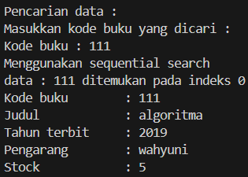

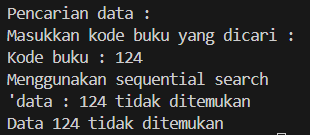

Pertanyaan:
1. Jelaskan fungsi break yang ada pada method FindSeqSearch!
2. Jika Data Kode Buku yang dimasukkan tidak terurut dari kecil ke besar. Apakah program masih 
dapat berjalan? Apakah hasil yang dikeluarkan benar? Tunjukkan hasil screenshoot untuk bukti 
dengan kode Buku yang acak. Jelaskan Mengapa hal tersebut bisa terjadi?
3. Buat method baru dengan nama FindBuku menggunakan konsep sequential search dengan tipe 
method dari FindBuku adalah BukuNoAbsen. Sehingga Anda bisa memanggil method 
tersebut pada class BukuMain seperti gambar berikut :
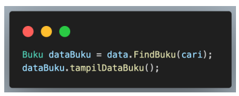

Jawaban:
1. Berfungsi untuk menghentikan perulangan.
2. Program masih bisa berjalan karena sequential search tidak harus terurut.
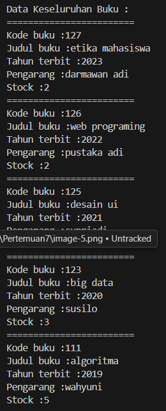

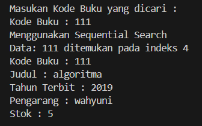

3. 
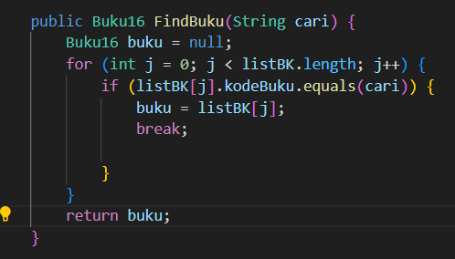

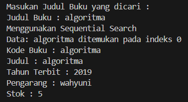

## Percobaan 2: Searching / Pencarian Menggunakan Binary Search

Hasil Running Program:

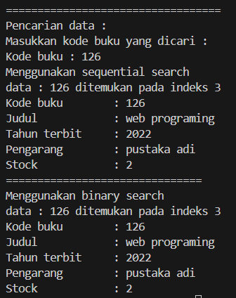

Pertanyaan:
1. Tunjukkan pada kode program yang mana proses divide dijalankan!
2. Tunjukkan pada kode program yang mana proses conquer dijalankan!
3. Jika data Kode Buku yang dimasukkan tidak urut. Apakah program masih dapat berjalan? Mengapa 
demikian! Tunjukkan hasil screenshoot untuk bukti dengan kode Buku yang acak. Jelaskan 
Mengapa hal tersebut bisa terjadi? 
4. Jika Kode Buku yang dimasukkan dari Kode Buku terbesar ke terkecil (missal : 20215, 20214, 
20212, 20211, 20210) dan elemen yang dicari adalah 20210. Bagaimana hasil dari binary search? 
Apakah sesuai? Jika tidak sesuai maka ubahlah kode program binary seach agar hasilnya sesuai!

Jawaban:
1. 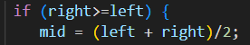
2. 
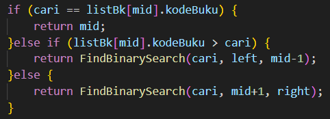

3. Iya, program masih dapat berjalan, tapi hasil dari binary search tidak dapat ditemukan, karena binary search memerlukan data yang terurut agar dapat ditemukan.

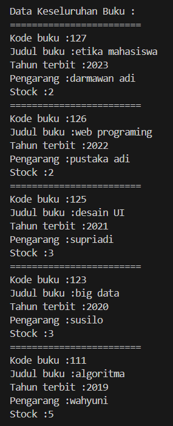

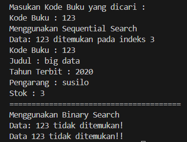

4. Hasil dari binary search tidak sesuai.

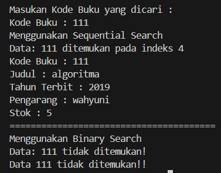

kode yang di modifikasi:

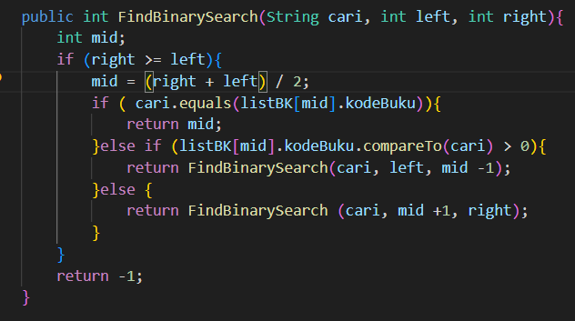

## Percobaan 3: Percobaan Pengayaan Divide and Conquer

Hasil Running Program:

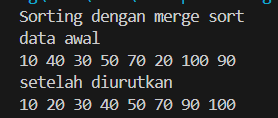

## . Latihan Praktikum

- Buku16

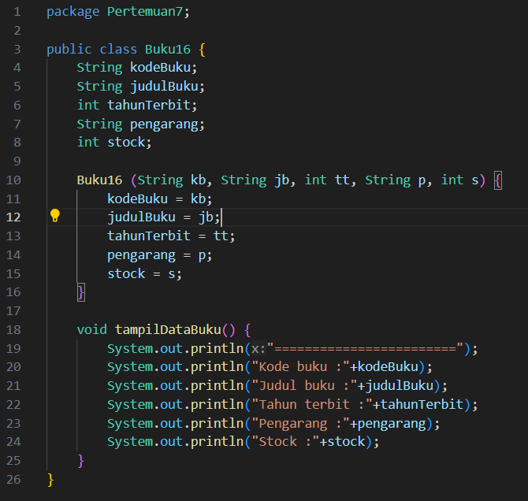

- PencarianBuku

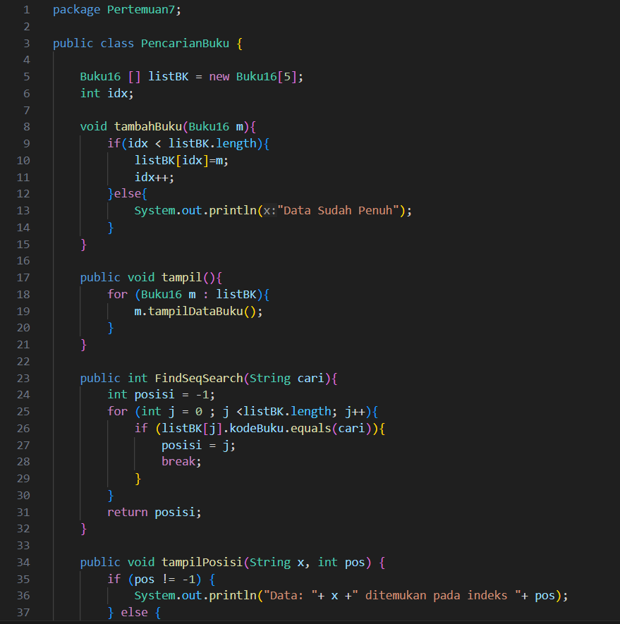

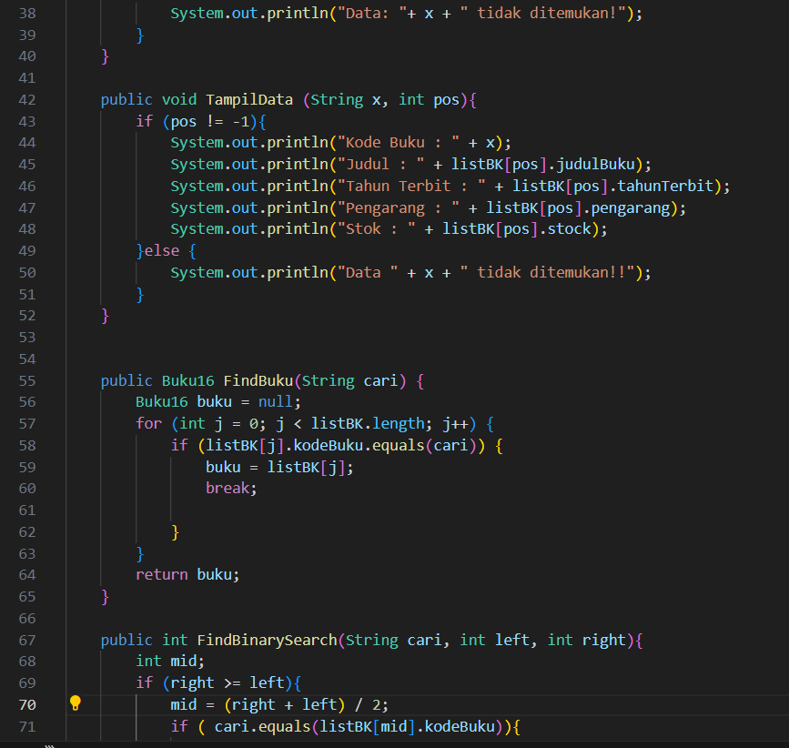

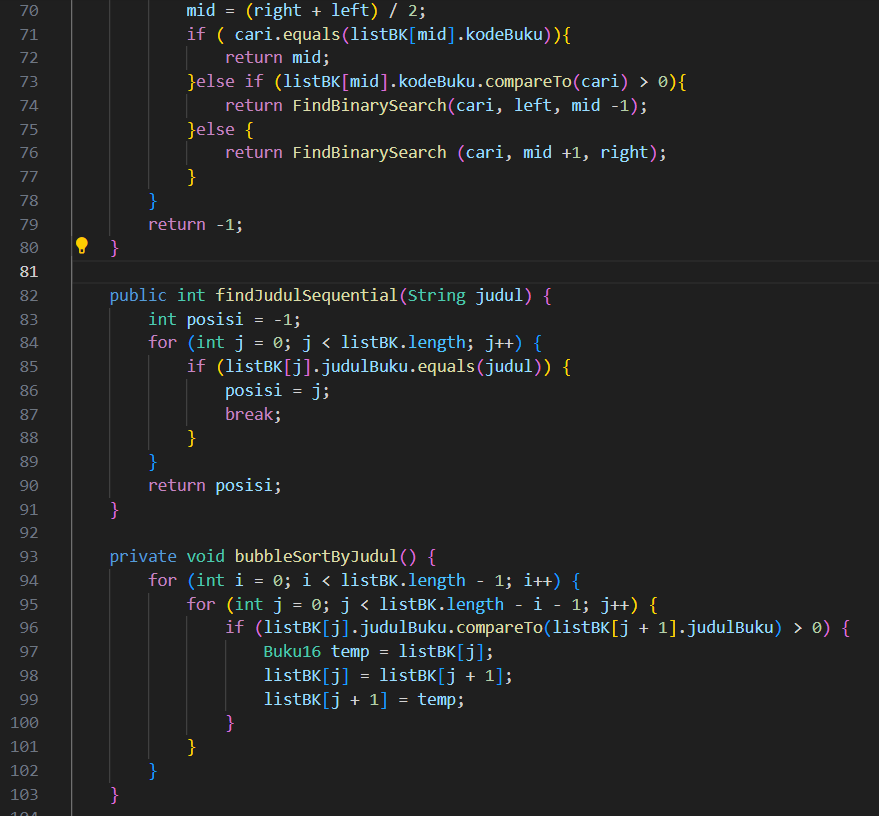

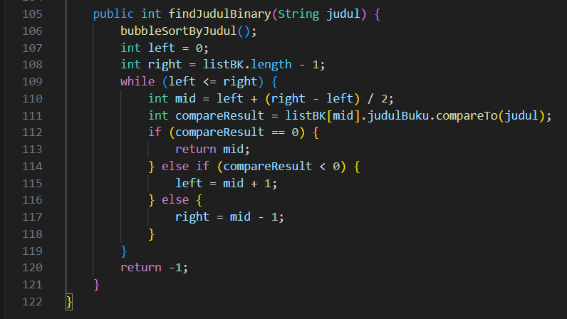

- BukuMain16

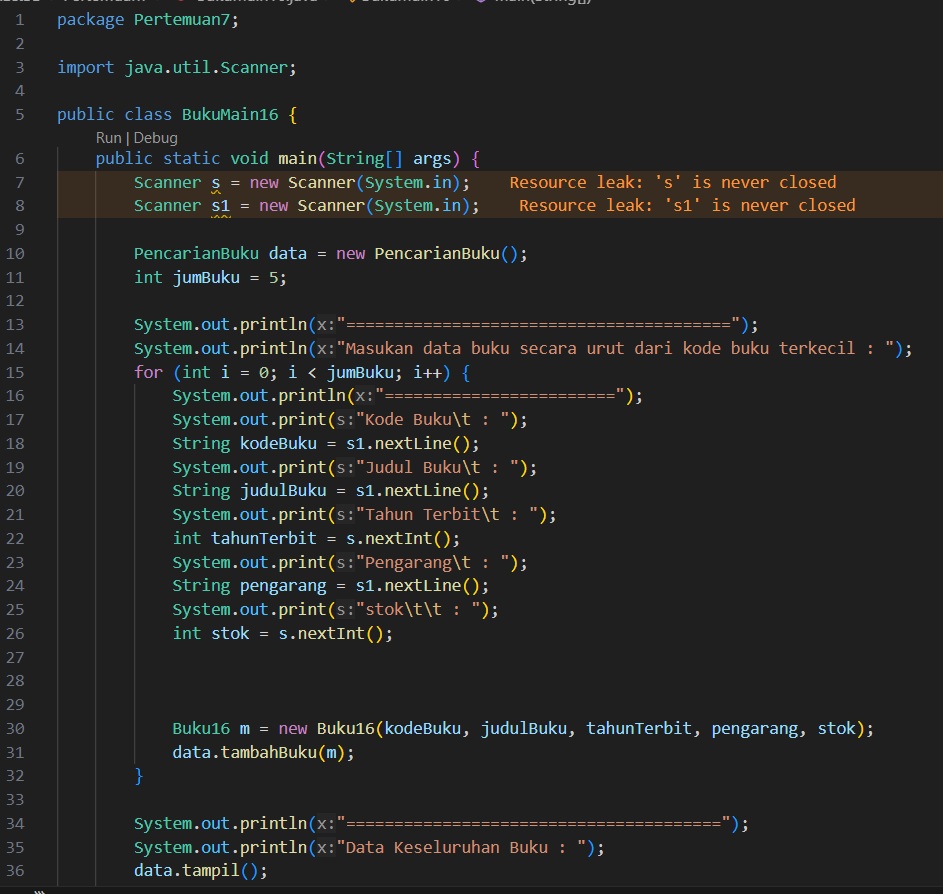

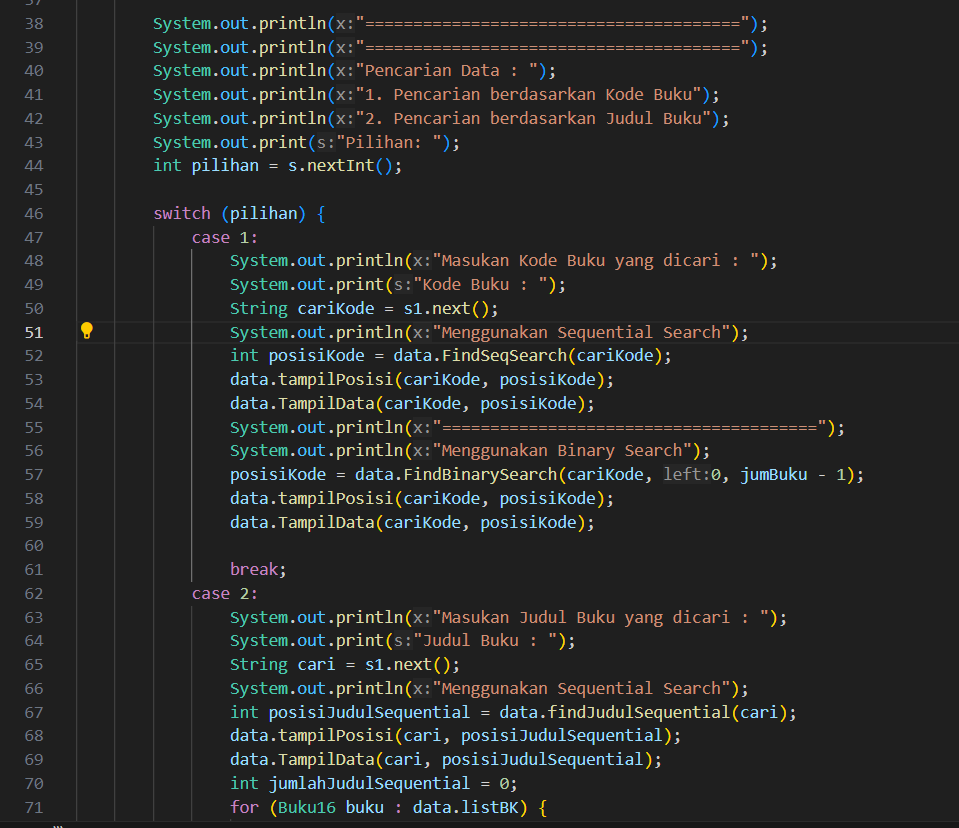

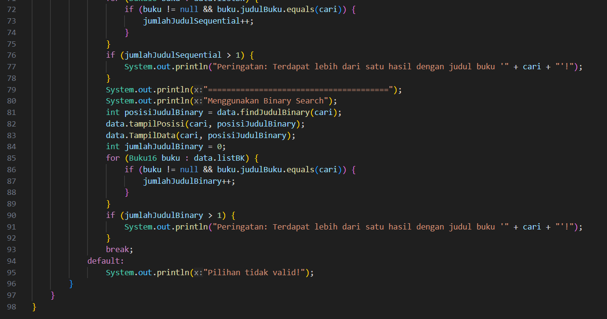

