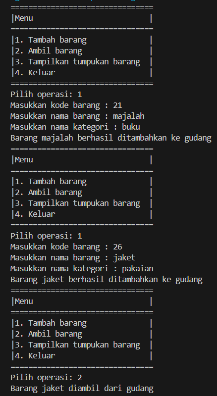
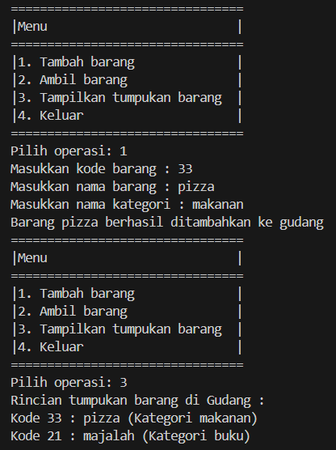
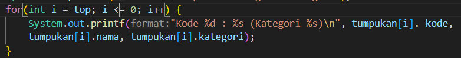
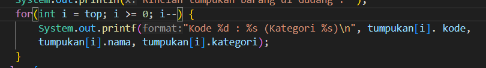
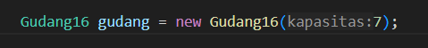
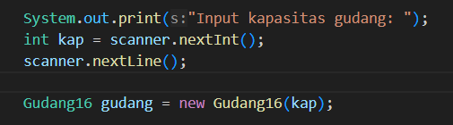
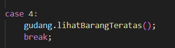

# Laporan Praktikum 8

## Percobaan 1: Penyimpanan Tumpukan Barang dalam Gudang

Hasil Running Program:

Pertanyaan: 
1. Lakukan perbaikan pada kode program, sehingga keluaran yang dihasilkan sama dengan verifikasi 
hasil percobaan! Bagian mana saja yang perlu diperbaiki?
2. Berapa banyak data barang yang dapat ditampung di dalam tumpukan? Tunjukkan potongan kode 
programnya!
3. Mengapa perlu pengecekan kondisi !cekKosong() pada method tampilkanBarang? Kalau kondisi 
tersebut dihapus, apa dampaknya?
4. Modifikasi kode program pada class Utama sehingga pengguna juga dapat memilih operasi lihat 
barang teratas, serta dapat secara bebas menentukan kapasitas gudang!
5. Commit dan push kode program ke Github

jawaban:

1. 
- Bagian yang belum diperbaiki:

- Bagian yang sudah diperbaiki:

2. Banyak nya data yang dapat di tampung adalah 7 data.

3. Pengecekan kondisi gudang diperlukan untuk memastikan apakah ada barang atau tidak di dalamnya, jika tidak ada pengecekan, method tersebut tidak akan menampilkan informasi apa pun jika gudang kosong. Sebaliknya, jika melakukan pengecekan terlebih dahulu, kita dapat menentukan output yang sesuai, jika gudang tidak berisi barang, dengan kata lain, pengecekan kondisi gudang membantu method untuk memberikan informasi yang lebih akurat dan lengkap.
4. 
- Kode Program:

5. 

