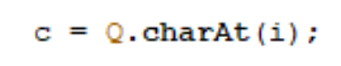

# Laporan Praktikum 8

## Percobaan 1: Penyimpanan Tumpukan Barang dalam Gudang

Hasil Running Program:

Pertanyaan: 
1. Lakukan perbaikan pada kode program, sehingga keluaran yang dihasilkan sama dengan verifikasi 
hasil percobaan! Bagian mana saja yang perlu diperbaiki?
2. Berapa banyak data barang yang dapat ditampung di dalam tumpukan? Tunjukkan potongan kode 
programnya!
3. Mengapa perlu pengecekan kondisi !cekKosong() pada method tampilkanBarang? Kalau kondisi 
tersebut dihapus, apa dampaknya?
4. Modifikasi kode program pada class Utama sehingga pengguna juga dapat memilih operasi lihat 
barang teratas, serta dapat secara bebas menentukan kapasitas gudang!
5. Commit dan push kode program ke Github

jawaban:

1. 
- Bagian yang belum diperbaiki:

- Bagian yang sudah diperbaiki:

2. Banyak nya data yang dapat di tampung adalah 7 data.

3. Pengecekan kondisi gudang diperlukan untuk memastikan apakah ada barang atau tidak di dalamnya, jika tidak ada pengecekan, method tersebut tidak akan menampilkan informasi apa pun jika gudang kosong. Sebaliknya, jika melakukan pengecekan terlebih dahulu, kita dapat menentukan output yang sesuai, jika gudang tidak berisi barang, dengan kata lain, pengecekan kondisi gudang membantu method untuk memberikan informasi yang lebih akurat dan lengkap.
4. 
- Kode Program:

5. 

## Percobaan 2: Konversi Kode Barang ke Biner 

Hasil Running Program:

Pertanyaan:
1. Pada method konversiDesimalKeBiner, ubah kondisi perulangan menjadi while (kode != 0), bagaimana hasilnya? Jelaskan alasannya!
2. Jelaskan alur kerja dari method konversiDesimalKeBiner!

Jawaban:
1. Hasilnya tetap sama dan program masih dapat dijalankan. Hal ini terjadi karena nilai kode (kode dari barang yang dihapus) seharusnya bernilai min (-). Jika menggunakan kondisi kode > 0, maka output dari kode unik akan bernilai null (kosong). Namun, jika menggunakan kode != 0, maka output dari kode uniknya bernilai min (-). 

2. Nilai yang diberikan sebagai parameter akan diperiksa apakah nilainya lebih besar dari 0 atau tidak. Jika nilainya lebih besar dari 0, maka program akan melakukan perulangan. Selama perulangan, nilai tersebut akan dimodulus dengan 2, dan sisa hasil modulusnya akan dimasukkan ke dalam variabel sisa. Kemudian, nilai sisa tersebut akan ditambahkan ke dalam objek stack menggunakan metode push. Setelah itu, nilai awal akan dibagi dengan 2, dan perulangan akan dilanjutkan sampai nilainya menjadi 0 (perulangan akan berhenti jika nilainya 0). Setelah perulangan selesai, program akan memeriksa apakah objek stack kosong atau tidak. Jika objek stack tidak kosong, maka nilai biner teratas dari stack akan diambil dan dimasukkan ke dalam variabel biner. Akhirnya, program akan mengembalikan nilai dari variabel biner tersebut. 

## Percobaan 3: Konversi Notasi Infix ke Postfix

Hasil Running Program:

Pertanyaan:
1. Pada method derajat, mengapa return value beberapa case bernilai sama? Apabila return 
value diubah dengan nilai berbeda-beda setiap case-nya, apa yang terjadi?
2. Jelaskan alur kerja method konversi!
3. Pada method konversi, apa fungsi dari potongan kode berikut?

Jawaban:
1. Beberapa case memiliki return value yang sama karena beberapa case operatornya memeiliki prioritas yang sama. Jika return valuenya diubah dengan nilai berbeda-beda maka kedudukan dari setiap operator akan berbeda-beda yang dimana akan menimbulkan error dalam konversi postfixnya.
2. 
- Variabel P digunakan untuk menyimpan hasil dari stack yang sudah diproses di variabel c. Program melakukan perulangan sebanyak n (panjang dari String Q). char ke i pada String Q akan dimasukkan ke variabel c untuk diproses. dan prosesnya sebagai berikut :

a. Jika adalah operand, maka langsung ditambahkan ke variabel P

b. Jika c adalah '(', maka ditambahkan ke stack menggunakan method push().

c. jika c adalah ')', maka semua karakter pada stack ditambahkan pada variabel P sampai '(' ditemukan dan '(' kemudian dihapus dari stack dengan method pop().

d. jika c adalah operator, maka char operator pada stack dengan kedudukan prioritas yang lebih tinggi ditambah di variabel P sampai char operator yang lebih rendah atau sama ditemukan dan operator tersebut kemudian ditambahkan menggunakan method push().

Setelah semua iterasi selesai, method mereturn nilai pada variabel P
3. Memasukkan char ke i pada String Q ke dalam variabel c (i sesuai dengan iterasinya dalam perulangan).

## Latihan Praktikum

Perhatikan dan gunakan kembali kode program pada Percobaan 1. Tambahkan dua method berikut 
pada class Gudang:
• Method lihatBarangTerbawah digunakan untuk mengecek barang pada tumpukan terbawah         
• Method cariBarang digunakan untuk mencari ada atau tidaknya barang berdasarkan kode
barangnya atau nama barangnya

jawaban:
- Method lihatBarangTerbawah digunakan untuk mengecek barang pada tumpukan terbawah

- Method cariBarang digunakan untuk mencari ada atau tidaknya barang berdasarkan kode
barangnya atau nama barangnya

- Output

